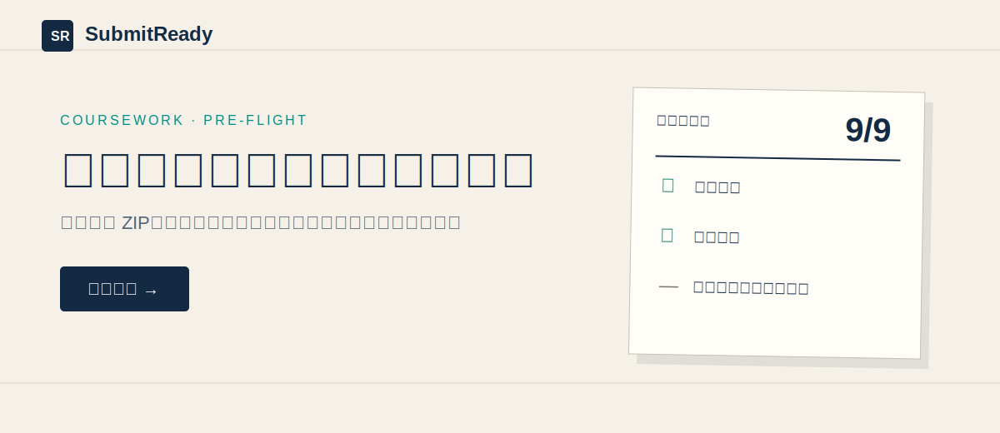
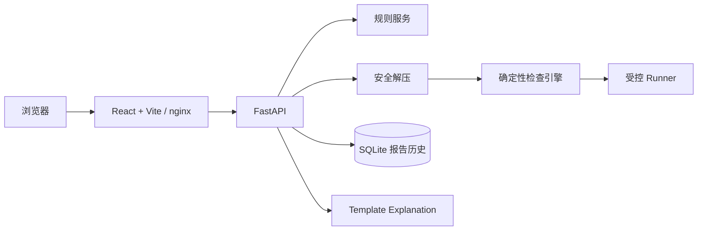

# SubmitReady

> 编程作业提交前检查平台：上传 ZIP、选择课程规则，一次发现结构、构建、测试、临时文件和敏感信息问题，并导出可复核报告。

很多作业不是因为算法错，而是因为漏交文件、压缩层级错误、编译失败、测试没跑或误交密钥而失分。SubmitReady 把这些问题变成一套版本化、确定性、可重复的提交前检查。项目是普通 Web 应用，不含自主 Agent 循环；核心流程不依赖 LLM 或 API Key。



## 功能

- 安全 ZIP 导入：上传/文件数/展开体积限制，Zip Slip、绝对路径、符号链接、重复项和损坏包拦截。
- 版本化 YAML 规则：C、C++、Python 内置规则，严格 Pydantic 校验，自定义规则导入。
- 确定性检查：必需/禁止文件、层级、空文件、大小、临时文件、语言和敏感信息。
- 受控执行：命令参数数组、超时、输出截断、环境白名单；默认关闭不可信代码执行。
- 报告与历史：SQLite 持久化，Web 详情、JSON/Markdown 导出、删除和重复提交区分。
- 辅助解释：默认模板 Provider，单次输入/输出，不读完整源码，不调用真实网络服务。

## 架构



默认数据流为同步检查；前端仍展示明确的检查状态并阻止重复提交。模块说明见 [架构文档](docs/ARCHITECTURE.md)。

## 环境要求

- Python 3.11+（本机验证：3.12.10）
- Node.js 20+ 与 npm（前端锁文件也支持 pnpm）
- 可选：Docker Engine + Compose v2
- 本地运行使用 SQLite，不需要外部数据库、账号或 API Key

## 最快启动：Docker Compose

- 在线演示：<https://submitready.onrender.com>
- 在线 API 文档：<https://submitready.onrender.com/docs>

```bash
docker compose up --build
```

打开：

- Web：<http://localhost:8080>
- API/OpenAPI：<http://localhost:8080/docs>

停止并清理容器：

```bash
docker compose down --remove-orphans
```

Compose 将后端设为非 root、只读根文件系统、禁用额外 capabilities，并限制 CPU、内存和进程数。当前开发机没有 Docker CLI，因此上述镜像构建/启动未在本机执行；CI 已配置 `docker compose config`、双镜像和单镜像构建门禁。请在提交前于有 Docker 的机器或 CI 上确认最后一次结果为通过。

## 本地开发

后端终端：

```bash
cd backend
python -m venv .venv
# Windows: .venv\Scripts\python -m pip install -e ".[dev]"
# Linux/macOS: .venv/bin/python -m pip install -e ".[dev]"
python -m pip install -e ".[dev]"
python -m uvicorn app.main:app --reload --host 127.0.0.1 --port 8000
```

前端终端：

```bash
cd frontend
npm install
npm run dev -- --host 127.0.0.1 --port 5173
```

打开 <http://127.0.0.1:5173>。Vite 会把 `/api` 代理到 `127.0.0.1:8000`。必须从 `frontend/` 目录启动 Vite；从仓库根直接启动会找不到 `index.html`。

## 一键测试

先安装后端与前端依赖，然后任选一个入口：

```bash
python scripts/test_all.py
make test
```

Windows PowerShell：

```powershell
./scripts/test-all.ps1
```

`python scripts/test_all.py` 在本开发机已真实验证，会依次执行 Ruff 格式/检查、strict mypy、21 个 pytest、凭据策略、ESLint、TypeScript、6 个 Vitest 和 Vite production build。系统有 npm 时会先安装前端依赖；Codex Desktop 环境也可复用其随附 Node 与已安装的本地依赖。

## 3–5 分钟演示

1. 生成确定性样例：`python scripts/generate_examples.py`。
2. 启动应用，打开“新建检查”。
3. 选择 `Python Course Assignment`，上传 `examples/generated/python-pass.zip`。
4. 查看通过/警告/失败/跳过统计和安全边界提示。
5. 导出 Markdown，再到“历史记录”查看并删除本次运行。

应用已启动时可自动验证 API 路径：

```bash
python scripts/demo.py --base-url http://localhost:8080
```

仅生成/校验离线样例：

```bash
python scripts/demo.py
```

完整话术与故障演示见 [演示文档](docs/DEMO.md)。没有示例账号：本版本是单机、无登录应用。

## 规则配置

规则是 schema version 1 的 YAML。内置示例位于 `examples/rules/`，Web“规则管理”页可以下载模板并导入自定义规则。命令必须是参数数组，不能由网页直接输入；同 ID 不覆盖。完整字段、范围和危险命令策略见 [SPEC](docs/SPEC.md) 与 [API 文档](docs/API.md)。

## AI 功能与凭据

本提交只启用 `TemplateExplanationProvider`，测试使用 `MockExplanationProvider`，不连接付费 LLM、不需要 API Key。核心检查全部是普通确定性代码。

因此 `.env.example` 只包含非秘密运行配置。项目不会要求用户把 Key 发到聊天、前端、数据库或日志。未来若增加真实 Provider，必须先实现 OS keyring/容器 secret 的录入、状态、更新和清除流程；仅把 Key 放入普通配置文件不满足本项目安全模型。

## 安全边界

- 上传、归档内容和规则一律视为不可信；验证失败默认拒绝。
- `ALLOW_UNTRUSTED_EXECUTION=false` 是默认值；此时构建/测试显示“跳过”。
- 受控 subprocess 有参数、环境、输出和超时边界，但不是完整沙箱，也不能保证 Windows 上阻断网络或所有子进程。
- Compose 的容器限制降低风险，应用内按运行创建 Docker 沙箱的 `DockerRunner` 仍只是接口。
- 公网演示保持 `SUBMITREADY_ALLOW_UNTRUSTED_EXECUTION=false`；不要用它执行陌生来源代码。

详见 [安全文档](docs/SECURITY.md)。

## 项目目录

```text
backend/        FastAPI、规则、解压、检查、Runner、SQLite、pytest
frontend/       React/TypeScript、六页 UI、Vitest
examples/       三份规则、七类项目、八个 ZIP 夹具
scripts/        测试、样例、演示、凭据扫描脚本
docker/         后端/前端镜像与 nginx 配置
docs/           规格、计划、过程、安全、演示与验证证据
.github/        GitHub Actions 质量门禁
```

## 常见问题

**为什么通过样例的构建/测试是“跳过”？**  
默认关闭不可信执行。这表示静态检查通过，不表示代码已在沙箱中运行。只对自己信任的项目设置 `SUBMITREADY_ALLOW_UNTRUSTED_EXECUTION=true`。

**上传后规则列表为空？**  
确认从仓库根启动 Compose，或后端工作目录为 `backend/`；也可设置 `SUBMITREADY_BUILTIN_RULES_DIR` 为 `examples/rules` 的绝对路径。

**Docker 启动失败？**  
先运行 `docker compose config`，确认 Compose v2 可用，并查看 [故障排查](docs/TROUBLESHOOTING.md)。

**是否会把项目发给 AI？**  
不会。本版本没有网络 LLM Provider；模板解释只读取本地、已截断和脱敏的错误摘要。

## 文档索引

- [产品与工程规格](docs/SPEC.md)
- [实现计划](docs/PLAN.md)
- [规约形成过程](docs/SPEC_PROCESS.md)
- [架构](docs/ARCHITECTURE.md)
- [安全](docs/SECURITY.md)
- [API](docs/API.md)
- [演示](docs/DEMO.md)
- [冷启动报告](docs/COLD_START_REPORT.md)
- [开发日志](docs/AGENT_LOG.md)
- [本地 PR 替代记录](docs/PR_HISTORY.md)
- [反思草稿与学生核验说明](docs/REFLECTION.md)
- [贡献指南](CONTRIBUTING.md)

## 已知限制

- 检查请求同步执行，未实现后台队列和真实逐阶段进度流。
- subprocess 不是完整沙箱；应用内 DockerRunner 未实现。
- 本机缺 Docker；Docker 构建已由 GitHub Actions 和 Render 部署验证，但 Compose `up/down` 未在本机执行。
- 公网演示已部署到 Render；免费实例闲置后会休眠，SQLite 历史在重启或重新部署后可能丢失。
- 尚未发布公共 registry 镜像。
- SQLite 适合单实例，不支持多副本共享状态。
- 当前过程环境未提供课程指定 Superpowers/Open Design 技能，也未完成“不同产品智能体”冷读；偏差已如实记录。
- `REFLECTION` 必须由学生本人审阅、改写并确认，不能把 AI 草稿冒充个人反思。

## 许可证

MIT，见 [LICENSE](LICENSE)。
